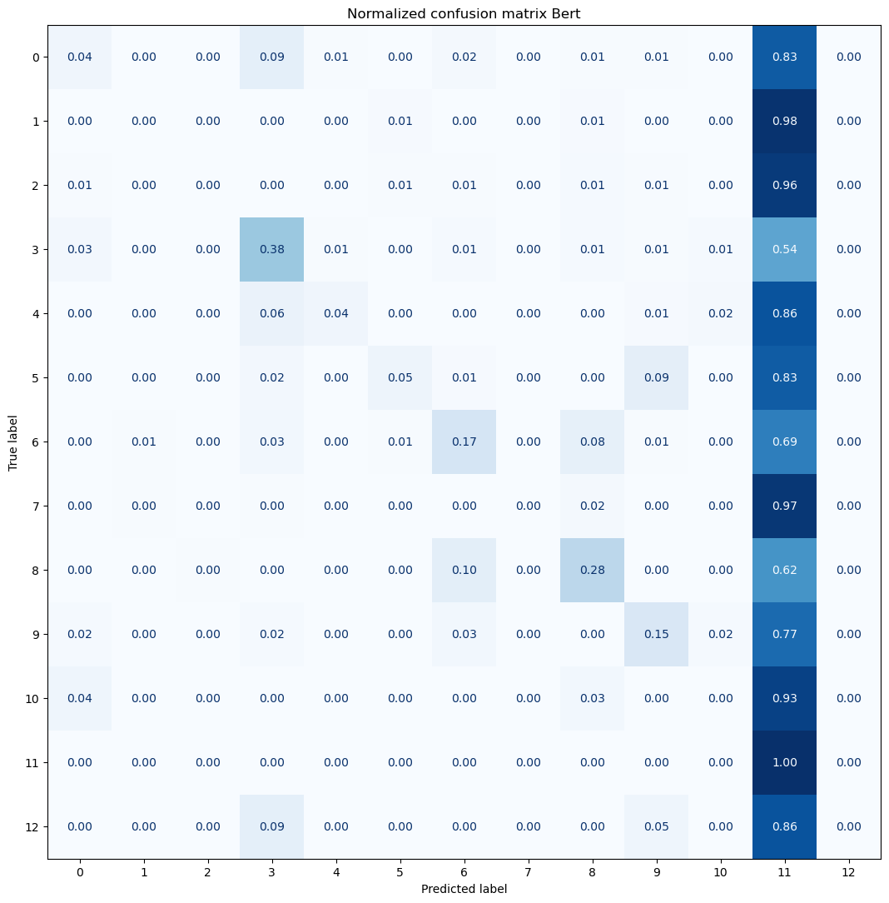
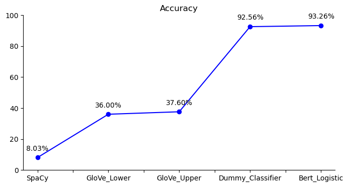

# WNUT17

## Prediction of IOB-Tags

This is a project that I conducted with 3 master's colleagues. We analyze the dataset for the WNUT 17 Emerging Entities task [This is the link](https://github.com/nluninja/nlp_datasets/tree/main/WNUT17/data). It contains text from Twitter, Stack Overflow responses, YouTube comments, and Reddit comments.
We use the two dataset 'train' and 'test' for computing the analysis. Both of them are in the IOB format (inside, outside, beginning).

### DATA STORING
In this section we upload the two dataset train and test. We concatenate the two dataframes in order to obtain a unique one with all the words and IOB tags stored.

### DATA VISUALIZATION
Visual representazion of our data: 
- first of all we create a **word cloud** of our text dataset superimposing the words onto a mask of a famous bird.
  
  
  
- we plot a **waffle chart** that represents the proportions of different IOB tags in our dataset.
  
  

- at the end we develop an interactive dashboard to facilitate the visualization of various plots. The dashboard features a left-hand menu where users can select the desired graph by clicking on its title. Subsequently, the corresponding graph will be displayed on the right-hand side. Within this dashboard, users have access to two histograms representing the lengths of sentences – one encompassing all words and the other excluding stopwords. Additionally, two bar charts are included to illustrate the frequency distribution of various IOB tags, with values organized in ascending order. The first one includes all IOB tags, the second is done without the 'O' tag for the same reasons of the waffle chart.

###  Comparison between our IOB tags and the SpaCy model

The objective of this workflow is to utilize SpaCy's capabilities to efficiently identify, categorize, and extract entities and their types from textual data and then do a comparison between our IOB tags and the SpaCy model.

To quantitatively assess the accuracy of entity identification we determine the common entities between two separate datasets (the original one and the one of spacy). The calculated accuracy metric helps to judge the alignment of the datasets.

The evaluation of SpaCy's entity labeling accuracy reveals an achieved accuracy of 42.45%. Meaning the alignment between the labels generated by SpaCy and the original dataset's labels for common entities.

## NEURAL NETWORK APPROACH FOR THE NLP USE CASE

### LSTM FOR NER

We implement this model in two situations: lower case and upper case. The results are very similar.

We use Bidirectional Long Short-Term Memory "BiLSTM" that is a type of recurrent neural network that operates on sequential data, such as text. Furthermore, we use GloVe "Global Vectors for Word Representation" that is a model of representation of words (word embedding) developed to capture the semantic relationships between words in a text. 

For a deeper analysis we made a comparison between lower-case and upper-case. After changing the quantity of the epochs several times, we noticed that, from the point of view of accuracy, the upper-case is slightly better than the lower-case. 
This is probably because the LSTM takes individual tokens into account, so capital letters can act as an additional information.

## Transformer Based Approach for the NLP use case

### BERT-Bidirectional Encorder Representation for Trasformers

### Training a simple classifier

The Logistic Regression and the Dummy classifier both have a high accuracy in predicting the labels of our DistilBert model. This is due to the fact that our dataset is completely unbalanced, containing 89% of 'O' tags. Logistic regression is designed to model the probability of belonging to a class. 

Dummy Classifier is a classifier model that makes predictions without trying to find patterns in the data. The default model essentially looks at what label is more frequent in the training dataset and makes predictions based on that label. Since we have a so unbalanced class, these two models present a good level of accuracy because in just taking into consideration the 'O' class we can label correctly the 89% of our dataset.

## Comparison on models' accuracies

## Results

We can declare that the BERT model proved to be the most effective, exhibiting higher accuracy compared to other models and achieving superior precision in labeling words for our purposes.

