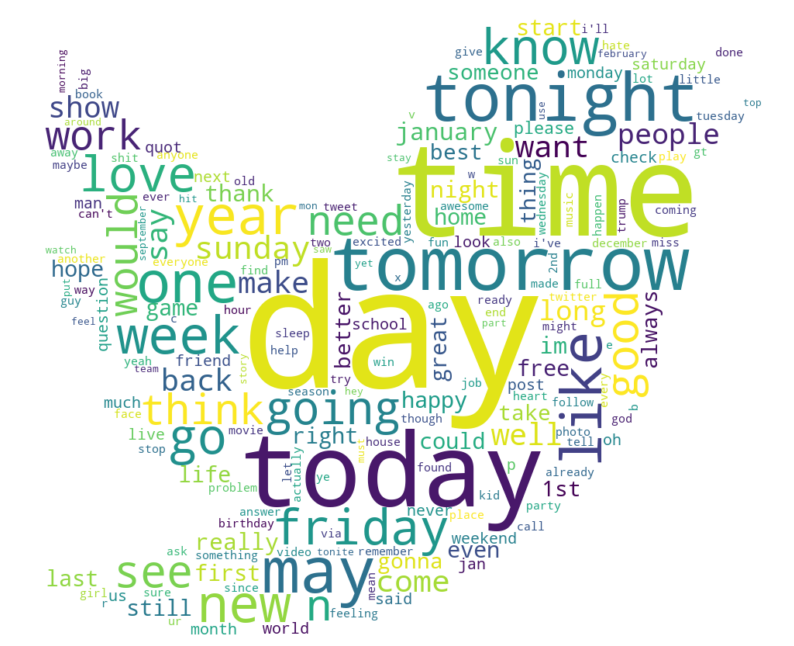
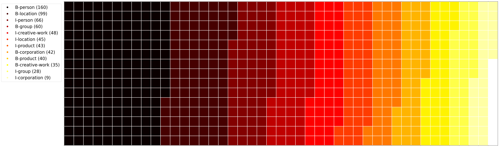

# WNUT17

## Prediction of IOB-Tags

This is a project that I conducted with 3 master's colleagues. We analyze the dataset for the WNUT 17 Emerging Entities task [This is the link](https://github.com/nluninja/nlp_datasets/tree/main/WNUT17/data). It contains text from Twitter, Stack Overflow responses, YouTube comments, and Reddit comments.
We use the two dataset 'train' and 'test' for computing the analysis. Both of them are in the IOB format (inside, outside, beginning).

### DATA STORING
In this section we upload the two dataset train and test. We concatenate the two dataframes in order to obtain a unique one with all the words and IOB tags stored.

### DATA VISUALIZATION
Visual representazion of our data: 
- first of all we create a **word cloud** of our text dataset superimposing the words onto a mask of a famous bird.
  
  
  
- Then, we plot a **waffle chart** that represents the proportions of different IOB tags in our dataset.
  
  
